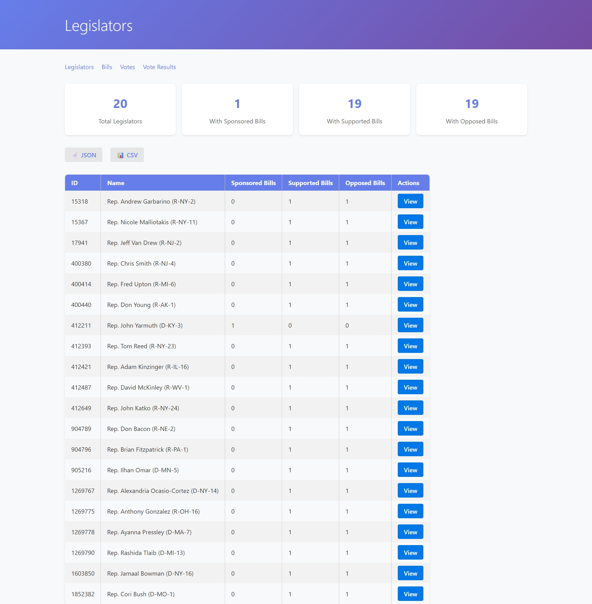
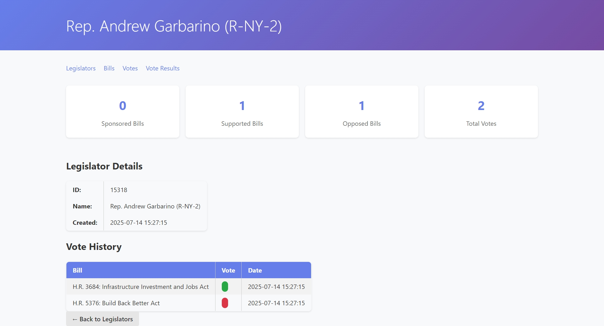
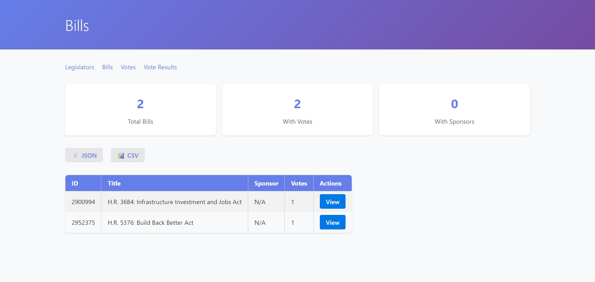
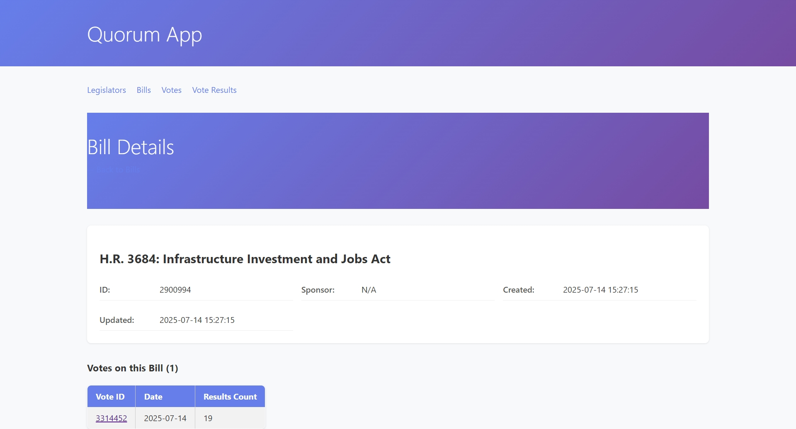
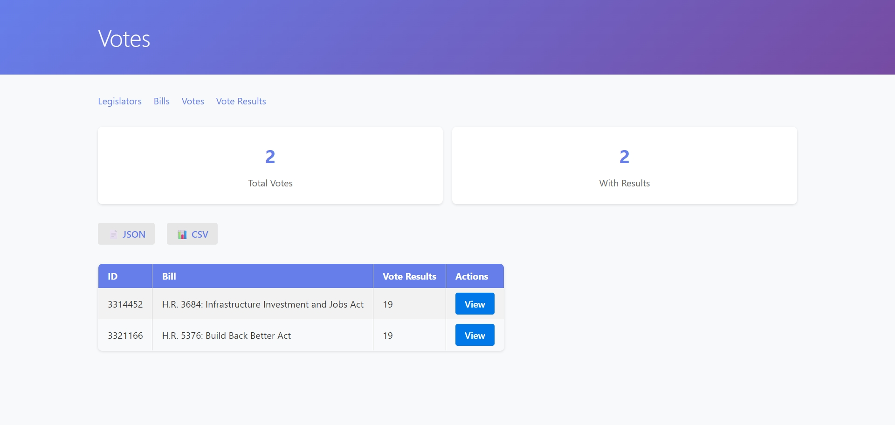
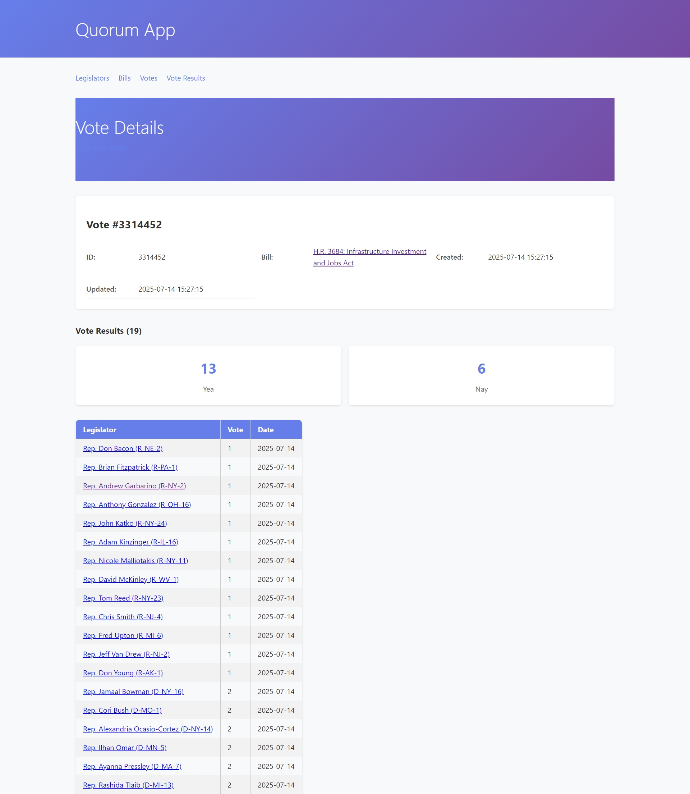
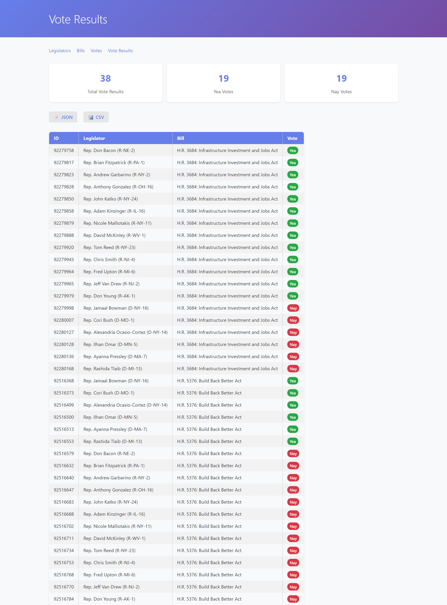

# Quorum App (Python/Flask)

A Flask + SQLAlchemy web app for managing and displaying legislative data from CSV files. 

## Context

This project is a python implementation of a previous [Ruby on Rails challenge](https://github.com/w-osilva/quorum-app) that I completed last year. Below are the links to the documentation files that provide more context about the challenge and my implementation:

- [Challenge Overview](docs/challenge.md) - The full challenge description and requirements.
- [Implementation Strategy](docs/questions.md) - Details about my implementation strategy, decisions, and answers to the challenge questions.

---

## Prerequisites

- Python 3.8+ (tested with Python 3.13)
- pip (Python package installer)

---

## Quick Start

### 1. Clone the Repository

```bash
git clone https://github.com/w-osilva/quorum_app_python.git
cd quorum_app_python
```

### 2. Setup Environment

```bash
./setup.sh  # Handles all setup automatically
```

### 3. Run the App

```bash
make server
```

- Web: [http://localhost:8000/](http://localhost:8000/)

### Screenshots

<details>
<summary>📸 Legislators</summary>


</details>

<details>
<summary>📸 Legislator Details</summary>


</details>

<details>
<summary>📸 Bills</summary>


</details>

<details>
<summary>📸 Bill Details</summary>


</details>

<details>
<summary>📸 Votes</summary>


</details>

<details>
<summary>📸 Vote Details</summary>


</details>

<details>
<summary>📸 Vote Results</summary>


</details>

## Development

### Manual Setup

```bash
# Create and activate a Python virtual environment
python -m venv .venv
source .venv/bin/activate

# Install required packages
make install 

# Create the database and import initial data
make db-create 
make db-import
```

### Makefile Commands
This project uses a Makefile to simplify common development tasks, below are some handy commands:

```bash
make help            # Show all available commands
make install         # Install production and development dependencies
make lint            # Run Ruff linter on Python code
make test            # Run tests
make coverage        # Run tests with coverage
make clean           # Clean up build artifacts
make db-create       # Create database tables
make db-drop         # Drop database tables
make db-reset        # Drop and recreate all tables
make db-import       # Import data from CSV files
make server          # Run Flask webserver   
```

## Troubleshooting

### Database Issues
If you need to reset the database to a clean state, you can use the following command:
```bash
make db-reset
```

Or use the database management script directly for more granular control:
```bash
python scripts/database.py reset --with-data   # Drop all tables and recreate them
python scripts/database.py drop legislators    # Drop specific table
python scripts/database.py create bills votes  # Create specific tables
```

### Virtual Environment Issues
Make sure you're using the correct virtual environment:
```bash
which python  # Should point to your .venv/bin/python
pip list      # Should show the installed packages
```


## Project Structure

Key components:
```
quorum-app-python/
├── app/            # Flask application (models, routes, templates)
├── data/           # CSV datasets + SQLite database
├── scripts/        # Database/import CLI utilities
└── tests/          # Full test coverage
```

## Tech Stack

- **Core**: Flask 2.3 + SQLAlchemy 2.0
- **Validation**: Pydantic models
- **Testing**: pytest (~85% coverage)
- **Tooling**: 
  - Ruff + djlint - Code quality
  - Make - Task automation
  - Custom responders - Multi-format API

## Features

### Multi-Format API
All endpoints support multiple output formats:
- **HTML:** Default web interface
- **JSON:** Add `?format=json` or `Accept: application/json`
- **CSV:** Add `?format=csv` or `Accept: text/csv`

### Data Management
- Import legislative data from CSV files
- Automatic database schema creation  
- Relationship mapping between entities
- Database management CLI with table-specific operations
- Support for creating, dropping, and resetting individual tables

### Web Interface
- Browse legislators, bills, votes, and vote results
- Clean, responsive design with PureCSS
- Easy navigation between related entities

## License

Part of the Quorum code challenge.